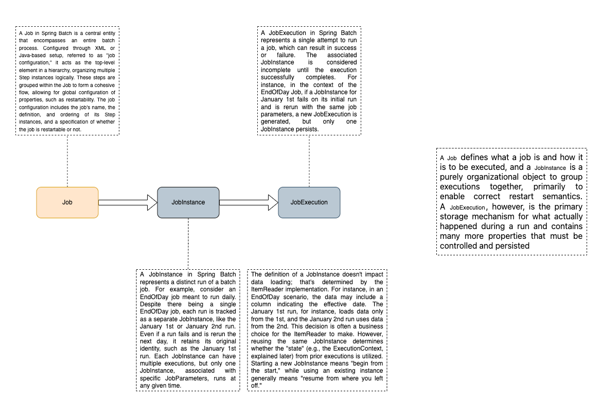
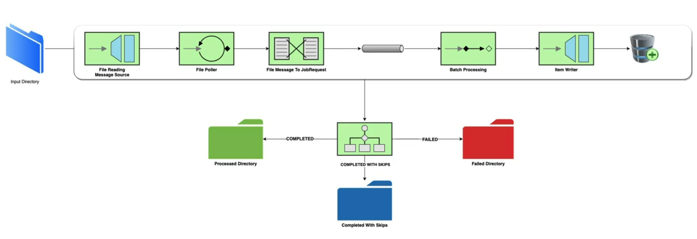

# Spring Batch 

This repository demonstrates the process of batch file polling and upload into a database through batch processing.

---

## Introduction

Spring Batch is a framework for building robust and scalable batch processing applications in Java. It simplifies the development of batch jobs by providing reusable building blocks.

---
## Job

A **Job** in Spring Batch is the top-level entity that encapsulates an entire batch process. It is configured using either XML or Java-based configuration. A Job is a container for **Step** instances, grouping logically related steps together. It allows for global configuration, such as restartability.

---

## Step
A Step is a fundamental building block within a Job. It represents a single phase of the batch processing and consists of an ItemReader, ItemProcessor, and ItemWriter. Steps are organized within a Job to create a flow, and each step can be configured individually.

---

## JobInstance

A **JobInstance** represents a logical run of a batch job. For example, if you have a daily job, each run on a specific day is a separate JobInstance. It helps track and manage individual job runs. Each JobInstance can have multiple JobExecutions, but only one JobInstance can run at a given time.

### Example Scenario:
- January 1st run
- January 2nd run

## JobExecution
A JobExecution represents a single attempt to run a Job. It can end in success or failure. A JobInstance is considered incomplete until the JobExecution successfully completes. Even if a JobInstance is rerun, a new JobExecution is created. A JobExecution is the primary storage for the details of what happened during a run.

### Example Scenario:
- January 1st run (initial run)
- January 1st run (rerun)

## Getting Started
To get started with Spring Batch, you can follow these steps:

### Set up your Spring Batch project.
- Define your Job and configure its steps.
- Implement ItemReader, ItemProcessor, and ItemWriter for your specific use case.
- Configure your database and set up any necessary infrastructure.
- Run your Spring Batch job and monitor the JobExecution details.

### Application system design architecture

### More details

For more details, please refer to the Spring batch official documentation [Visit the official Spring Batch Documentation](https://docs.spring.io/spring-batch/docs/current/reference/html/index.html)
